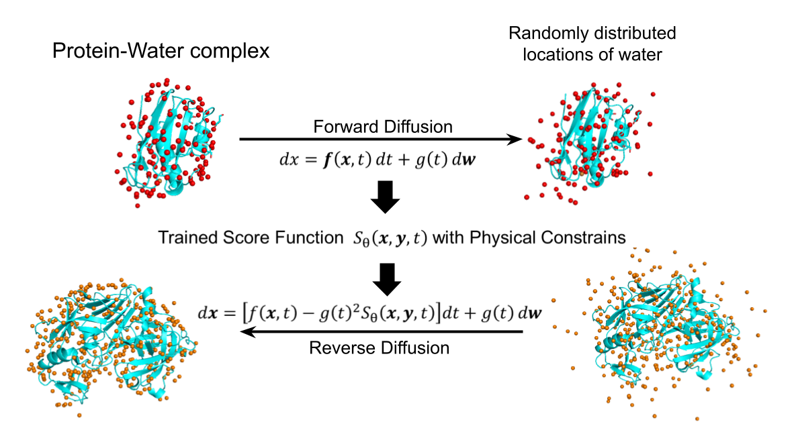
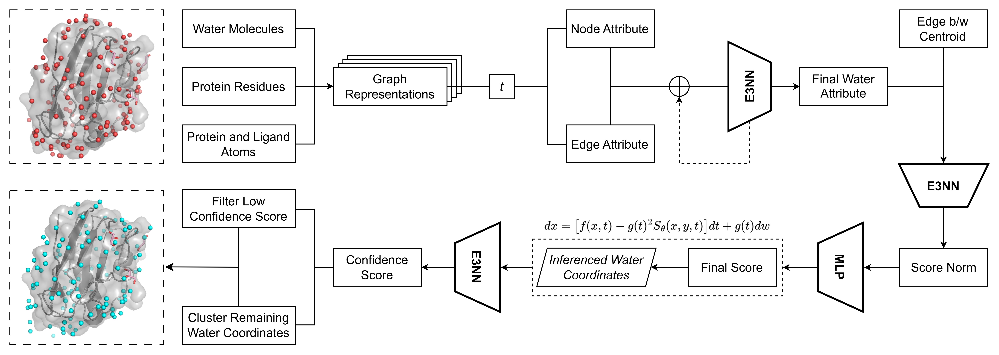
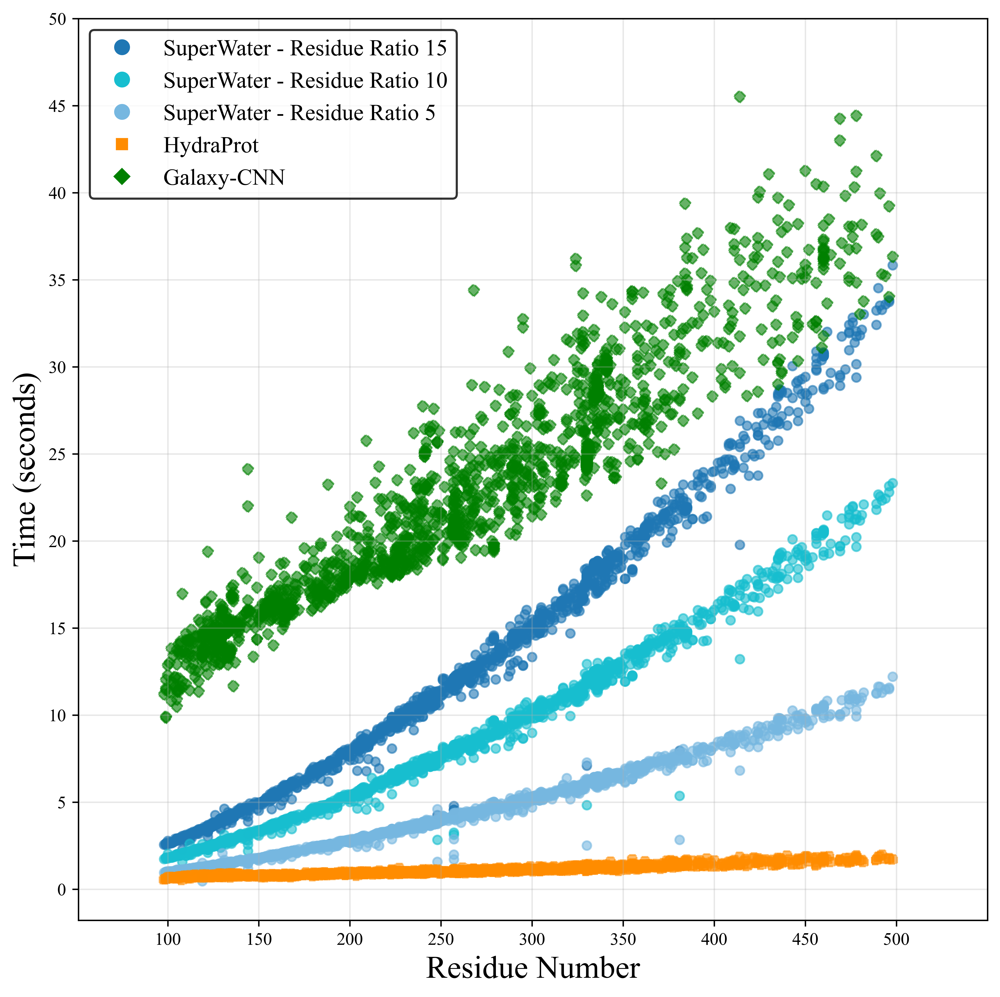
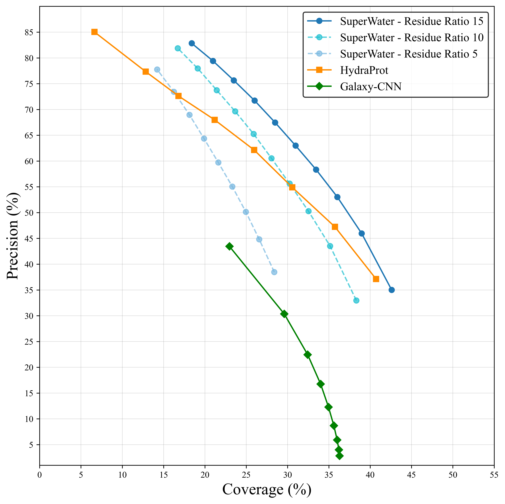
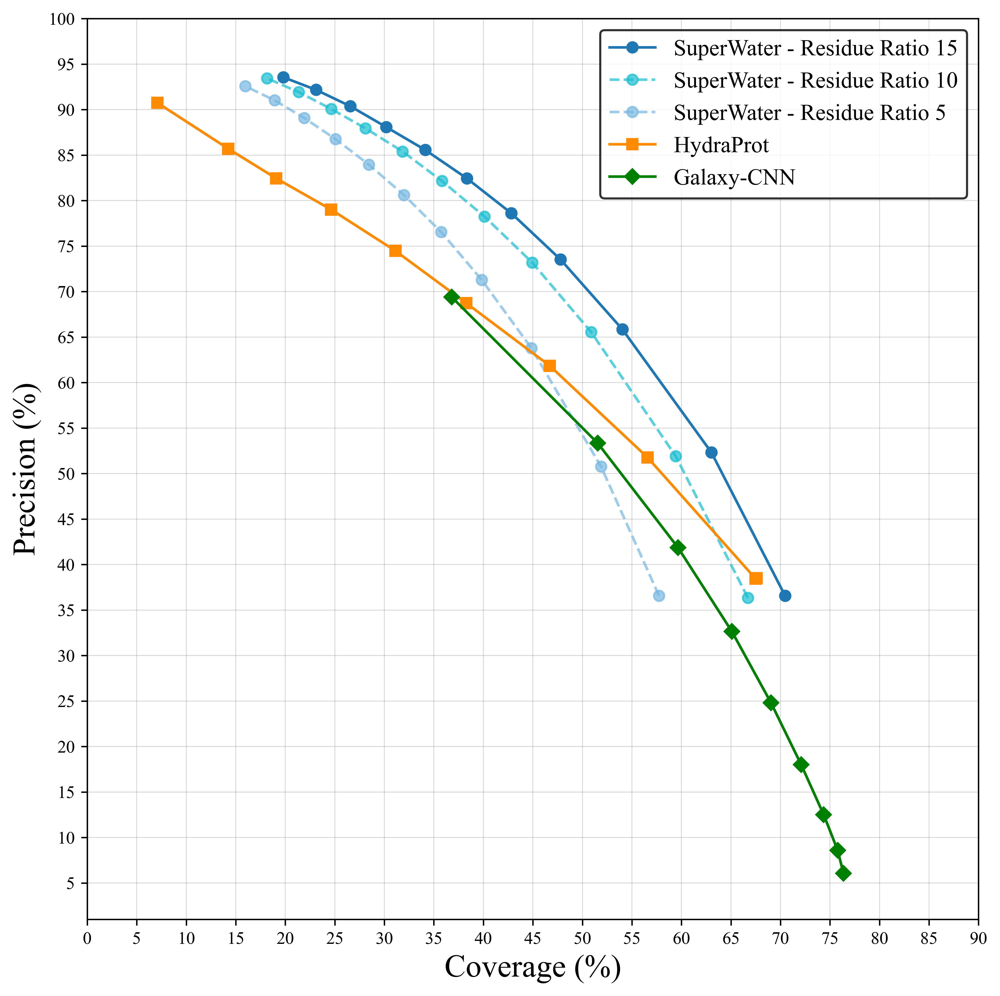
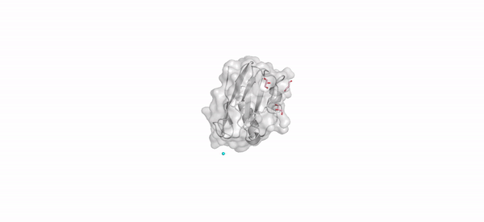

# SuperWater

SuperWater is a generative model designed to predict water molecule distributions on protein surfaces using score-based diffusion models and equivariant neural networks. The model and methodology are described in our [preprint on bioRxiv](https://www.biorxiv.org/content/10.1101/2024.11.18.624208v1).

For any questions, feel free to open an issue or contact us at: xiaohan.kuang@vanderbilt.edu, zhaoqian.su@vanderbilt.edu

## Overview

<!-- ### Diffusion Process
 -->

### Model Architecture


## Data Availability
The dataset used in this project can be found at [Zenodo](https://doi.org/10.5281/zenodo.14166655).  
Download the `waterbind.zip` file, which contains 17,092 protein PDB IDs and their corresponding water molecule files.

## Environment Setup
1. Create the Conda environment by running:
    ```bash
    conda env create -f environment.yml
    ```

    Activate the environment:
    ```bash
    conda activate superwater
    ```
    **Note**: This program has been tested on an Nvidia A6000. If you encounter issues related to `torch-cluster` version compatibility, please install a version that matches your working environment.

2. Set up ESM:
    
   Clone the [ESM GitHub repository](https://github.com/facebookresearch/esm) and save it under `esm/` in the project directory.


## Retraining Process
<details>
<summary><strong>Click to expand retraining details</strong></summary>

### Step 1: Training Dataset Preparation
Place your dataset folder under the `data/` directory. The dataset should be organized as follows:

```
data/
└── dataset/
    └── 5SRF/                               # Create folder for each PDB ID
        ├── 5SRF_protein_processed.pdb      # Naming pattern: <PDB_ID>_protein_processed.pdb
        ├── 5SRF_water.mol2                 # Water molecule file in MOL2 format
        └── 5SRF_water.pdb                  # Water molecule file in PDB format
```

Store the dataset split files under `data/splits/`:
```
data/
└── splits/
    ├── train_res15.txt                     # Training set PDB IDs
    ├── val_res15.txt                       # Validation set PDB IDs
    └── test_res15.txt                      # Test set PDB IDs
```

### Step 2: Generate ESM Embeddings

1. **Prepare FASTA files**:
    ```
    python datasets/esm_embedding_preparation_water.py \
    --data_dir data/<your_dataset>_organized \
    --out_file data/prepared_for_esm_<your_dataset>_organized.fasta
    ```
2. **Generate embeddings**:
    ```
    cd data

    python ../esm/scripts/extract.py esm2_t33_650M_UR50D prepared_for_esm_<your_dataset>_organized.fasta \
    <your_dataset>_organized_embeddings_output --repr_layers 33 --include per_tok --truncation_seq_length 4096
    
    cd ..
    ```

### Step 3: Train the Score Model
Replace `entity` in line 138 of `train.py` with your `wandb` username, and provide your W&B API key when prompted in the terminal after executing the following code.

```
python -m train \
--run_name all_atoms_score_model_res15_17092_retrain \
--test_sigma_intervals \
--esm_embeddings_path data/<your_dataset>_organized_embeddings_output \
--data_dir data/<your_dataset>_organized \
--split_train data/splits/train_res15.txt \
--split_val data/splits/val_res15.txt \
--split_test data/splits/test_res15.txt \
--log_dir workdir \
--lr 1e-3 --tr_sigma_min 0.1 --tr_sigma_max 30 \
--batch_size 8 \
--ns 24 --nv 6 \
--num_conv_layers 3 \
--dynamic_max_cross \
--scheduler plateau --scale_by_sigma \
--dropout 0.1 --all_atoms \
--c_alpha_max_neighbors 24 --remove_hs \
--receptor_radius 15 \
--num_dataloader_workers 10 \
--num_workers 10 \
--wandb \
--cudnn_benchmark \
--use_ema --distance_embed_dim 64 \
--cross_distance_embed_dim 64 \
--sigma_embed_dim 64 \
--scheduler_patience 30 \
--n_epochs 300
```

### Step 4: Train the Confidence Model
Replace `entity` in line 287 of `confidence/confidence_train.py` with your `wandb` username, and provide your W&B API key when prompted in the terminal after executing the following code.

```
python -m confidence.confidence_train \
--original_model_dir workdir/all_atoms_score_model_res15_17092_retrain \
--data_dir data/<your_dataset>_organized \
--all_atoms \
--run_name confidence_model_retrain \
--split_train data/splits/train_res15.txt \
--split_val data/splits/val_res15.txt \
--split_test data/splits/test_res15.txt \
--inference_steps 20 \
--batch_size 8 \
--n_epochs 50 \
--wandb \
--lr 1e-3 \
--ns 24 \
--nv 6 \
--num_conv_layers 3 \
--dynamic_max_cross \
--scale_by_sigma \
--dropout 0.1 \
--remove_hs \
--esm_embeddings_path data/<your_dataset>_organized_embeddings_output \
--cache_creation_id 1 \
--cache_ids_to_combine 1 \
--running_mode train \
--mad_prediction
```
**Note**: If GPU memory is limited, consider adjusting:
```
--water_ratio 10
```
</details>

## Running Inference (WebUI)
Our work has been integrated into [tamarind.bio](https://www.tamarind.bio)

### Local Web Application for Predicting Water Molecule Positions
### Prerequisites
* Ensure you have activated the **Conda environment**.
* Navigate to the `webapp/` directory in your terminal.

### Start the Web Application
Run the following command in your terminal:
```
python app.py
```

Then, open your browser and go to: `http://localhost:8891/`

### Note on Inference Settings
* On the Inference page, the default water ratio is set to 1.
* Adjust this value based on your working environment.
* In our paper, we used a water ratio of 15 to achieve the best coverage rate. 
* The `Cleanup` button will remove any file related to the uploaded files.

## Running Inference (Terminal)
<details>
<summary><strong>Click to expand inference details</strong></summary>

### Inference Dataset Preparation
Place your dataset folder under `data/`. Your dataset folder should contain only `pdb_id.pdb` files of protein structures. Then, run the following command to organize your raw data into the required format for the program:
```
python organize_pdb_dataset.py \
--raw_data <your_dataset> \
--output_dir <your_dataset>_organized
```

**Actions Performed by the Script:**
1. Creates an organized dataset folder under `data/` named `<your_dataset>_organized`.
2. Generates a test split file in `data/splits/` named `<your_dataset>_organized.txt`, which lists all the test pdb IDs.
3. Due to the behavior of `extract.py` in ESM embedding, which automatically truncates `pdb_id` to the first four characters, the organized dataset folder and filenames will also be truncated accordingly. However, if multiple `pdb_ids` share the same truncated name, they will not be processed. A list of these duplicate truncated `pdb_ids` will be saved in `logs/duplicate_truncate_pdb_id.txt`.


### Step 1: Generate ESM Embeddings

1. **Prepare FASTA files**:
    ```
    python datasets/esm_embedding_preparation_water.py \
    --data_dir data/<your_dataset>_organized \
    --out_file data/prepared_for_esm_<your_dataset>_organized.fasta
    ```

2. **Generate embeddings**:
    ```
    cd data

    python ../esm/scripts/extract.py esm2_t33_650M_UR50D prepared_for_esm_<your_dataset>_organized.fasta \
    <your_dataset>_organized_embeddings_output --repr_layers 33 --include per_tok --truncation_seq_length 4096

    cd ..
    ```

### Step 2: Run Model Inference

Run the following command to perform inference:

```
python -m inference_water_pos \
--original_model_dir workdir/all_atoms_score_model_res15_17092 \
--confidence_dir workdir/confidence_model_17092_sigmoid_rr15 \
--data_dir data/<your_dataset>_organized \
--ckpt best_model.pt \
--all_atoms \
--cache_path data/cache_confidence \
--split_test data/splits/<your_dataset>_organized.txt \
--inference_steps 20 \
--esm_embeddings_path data/<your_dataset>_organized_embeddings_output \
--cap 0.1 \
--running_mode test \
--mad_prediction \
--save_pos
```

**Key Parameters**:
- `--data_dir`: Path to your test dataset folder (e.g., `data/test_dataset`)
- `--split_test`: Path to the test PDB IDs file (e.g., `data/splits/test.txt`)
- `--cap`: Probability cutoff for water molecule sampling 
    - Higher values increase precision but reduce coverage 
    - Acceptable range: [0.02, 0.5]
- `--save_pos`: Saves sampled water molecule positions as `.pdb` files

**Save Diffusion Process Animation**

To save intermediate steps of the reverse diffusion process as `.pdb` files, add the following flag:

```
--save_visualization
``` 

- Output Directory: `inference_out/diff_process`
- Visualization: Load the `.pdb` files in PyMOL or similar tools to animate and visualize the diffusion process frame by frame.


**Note**:
- Set `--water_ratio` to 10 or lower during inference to optimize memory usage.

  **Performance Considerations**:
  - Refer to our speed and performance tests to adjust the `water_ratio` value based on your working environment:
  
    **Inference Speed Comparison**  
    

    **Precision-Coverage Curve (Cutoff = 0.5 Å)**  
    
    
    **Precision-Coverage Curve (Cutoff = 1 Å)**  
    

- When modifying the dataset or resampling parameters, ensure to:
  - Specify a new cache path using `--cache_path`, or
  - Delete the existing cache to prevent conflicts.


### Output:

Predicted water molecule positions will be saved as `.pdb` files in:
```
inference_out/inferenced_pos_cap<#>/
```

</details>

## Inference Animation

The animation below illustrates how randomly distributed water molecules in 3D space align to their predicted positions on the protein surface during the reverse diffusion process.



