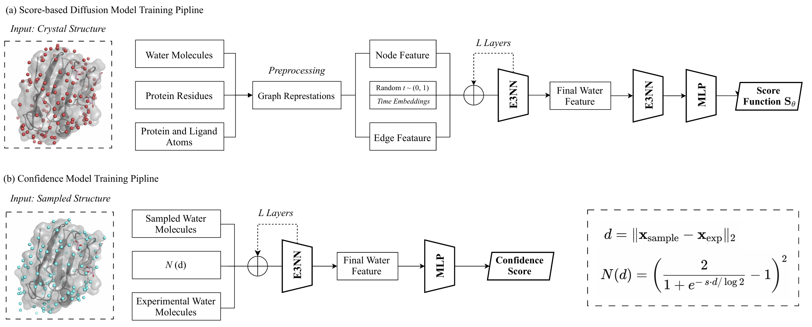
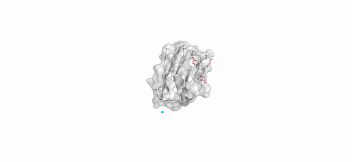

# SuperWater

[](https://doi.org/10.5281/zenodo.17465949)

SuperWater predicts water-molecule positions on protein surfaces using a score-based
diffusion model with equivariant neural networks (e3nn): random water "particles" are
moved onto hydration sites by reverse diffusion, a confidence model scores them, and a
clustering step produces the final waters.

Paper: *Communications Chemistry* ([article](https://www.nature.com/articles/s42004-025-01789-4)) ·
[bioRxiv preprint](https://www.biorxiv.org/content/10.1101/2024.11.18.624208v1) ·
Contact: xiaohan.kuang@takeda.com, zhaoqian.su@takeda.com



## Installation

Requires an NVIDIA GPU with CUDA 11.8 (CPU is not supported). One-command setup:

```bash
bash scripts/install.sh
conda activate superwater
```

This creates the `superwater` conda env (PyTorch 2.5.1+cu118, e3nn, rdkit, openbabel),
installs the PyTorch Geometric CUDA wheels, and runs `pip install -e .`. Equivalent manual
steps:

```bash
conda env create -f environment.yml
conda activate superwater
pip install -r requirements-pyg-cu118.txt
pip install -e .
```

Check the GPU with `python scripts/check_gpu.py`.

## Quick start

Pretrained models ship under `models/` and an example input folder is bundled. Predict
waters for every structure in a folder with one command:

```bash
superwater-predict --config examples/configs/predict_5srf.yaml
```

The first run downloads the ESM-2 model (~2.5 GB) to `~/.cache/torch`; embeddings are
generated in-process. Put one or many `.pdb`/`.cif`/`.mmcif` files in `input.structure_dir`
to run a batch — CIF/mmCIF inputs are converted automatically and unsupported files are
skipped. Outputs for each input `<name>` go to `outputs/predictions/<name>/`:

- `<name>_centroid.pdb` (or `.cif`) — final predicted waters. With `include_protein: true`
  (the example default) it also contains the input protein, with waters added as `HOH` on a
  separate chain.
- `<name>_centroid.txt` — final water coordinates (xyz).
- `<name>_filtered.txt` — all sampled positions + scores, written only when
  `save_filtered: true` (off by default).

### Config

`examples/configs/predict_5srf.yaml`:

```yaml
input:
  structure_dir: examples/data/batch_structures  # folder of .pdb/.cif/.mmcif files
  name: null              # optional name override (single-file input only)

models:
  score_model_dir: models/water_score_res15
  confidence_model_dir: models/water_confidence_res15_sigmoid

output:
  output_dir: outputs/predictions
  overwrite: true         # re-run structures whose output already exists
  format: pdb             # output structure format: pdb or cif
  include_protein: true   # include the input protein with the predicted waters

runtime:
  device: cuda            # only cuda is supported (no CPU)
  seed: 42                # random seed for reproducibility
  cleanup_intermediates: false  # delete this run's per-structure work files after success
  keep_embeddings: true   # keep the reusable ESM embeddings when cleaning up
  keep_graph_cache: true  # keep the reusable PyG graph cache when cleaning up

prediction:
  water_ratio: 10         # waters sampled per residue (higher = more coverage, more memory)
  inference_steps: 20     # number of reverse-diffusion steps
  confidence_cutoff: 0.1  # keep-probability threshold ~[0.02, 0.5] (higher = stricter)
  batch_size: 1           # structures scored per forward pass
  save_structure: true    # write <name>_centroid.{pdb,cif}
  save_filtered: false    # also write <name>_filtered.txt (off by default)
```

The example default writes **protein + predicted waters** and does **not** write the
filtered file. With `cleanup_intermediates: true`, per-run work files are removed after a
successful prediction while the reusable ESM embeddings and graph cache are kept (unless
`keep_embeddings`/`keep_graph_cache` are set to `false`).

## Web app

```bash
python apps/webapp/app.py
```

Open http://localhost:8891/, go to **Predict**, upload one or more `.pdb`/`.cif`/`.mmcif`
files, set the options (water ratio, inference steps, confidence cutoff, output format,
overwrite, include protein, cleanup), and run. Results appear per structure with a water
count and download links — per structure or all as a zip. Predictions run synchronously on
the GPU, so the page returns once the whole batch finishes.


## Retraining

<details>
<summary><strong>Show the retraining workflow</strong> (data prep, then score- and confidence-model training)</summary>

Retraining is a research-grade workflow (there is no single wrapper script): generate
ESM-2 embeddings, train the **score** model, then train the **confidence** model on water
positions sampled from it. The two stages are `python -m superwater.train` and
`python -m superwater.confidence.train` — run either with `--help` for the full argument
list. The commands below reproduce the shipped `water_score_res15` /
`water_confidence_res15_sigmoid` checkpoints; add `--wandb --wandb_entity <user>` to log to
Weights & Biases.

### 1. Prepare data

Download the dataset from [Zenodo](https://doi.org/10.5281/zenodo.17229778) (`waterbind`,
17,092 complexes) and place it under `data/<dataset>/`, one folder per complex:

```
data/<dataset>/<PDB_ID>/
├── <PDB_ID>_protein_processed.pdb
├── <PDB_ID>_water.mol2
└── <PDB_ID>_water.pdb
```

The paper's train/val/test splits are in `examples/data/splits/` (`train_res15.txt`,
`val_res15.txt`, `test_res15.txt`) — each is a plain list of PDB IDs; supply your own to
retrain on a different set.

### 2. Generate ESM-2 embeddings

```bash
superwater-embed --data_dir data/<dataset> --out_dir data/<dataset>_embeddings
```

### 3. Train the score (diffusion) model

```bash
python -m superwater.train \
    --run_name water_score_res15_retrain \
    --data_dir data/<dataset> \
    --esm_embeddings_path data/<dataset>_embeddings \
    --split_train examples/data/splits/train_res15.txt \
    --split_val   examples/data/splits/val_res15.txt \
    --split_test  examples/data/splits/test_res15.txt \
    --log_dir models \
    --all_atoms --remove_hs --receptor_radius 15 --c_alpha_max_neighbors 24 \
    --ns 24 --nv 6 --num_conv_layers 3 \
    --distance_embed_dim 64 --cross_distance_embed_dim 64 --sigma_embed_dim 64 \
    --tr_sigma_min 0.1 --tr_sigma_max 30 --scale_by_sigma --dynamic_max_cross \
    --lr 1e-3 --batch_size 8 --n_epochs 300 \
    --scheduler plateau --scheduler_patience 30 --dropout 0.1 \
    --use_ema --cudnn_benchmark --test_sigma_intervals \
    --num_workers 10 --num_dataloader_workers 10
```

Checkpoints are written to `models/water_score_res15_retrain/` (`best_model.pt`,
`best_ema_model.pt`, `last_model.pt`, `model_parameters.yml`). The dataset is preprocessed
into a graph cache on the first run and reused afterwards.

### 4. Train the confidence model

This samples water positions with the score model from step 3, caches them, and trains a
classifier on each water's deviation from the true sites. The dataset/architecture flags
must match the score model.

```bash
python -m superwater.confidence.train \
    --original_model_dir models/water_score_res15_retrain \
    --run_name water_confidence_res15_retrain \
    --data_dir data/<dataset> \
    --esm_embeddings_path data/<dataset>_embeddings \
    --split_train examples/data/splits/train_res15.txt \
    --split_val   examples/data/splits/val_res15.txt \
    --split_test  examples/data/splits/test_res15.txt \
    --log_dir models \
    --all_atoms --remove_hs \
    --ns 24 --nv 6 --num_conv_layers 3 --scale_by_sigma --dynamic_max_cross --dropout 0.1 \
    --inference_steps 20 --water_ratio 15 \
    --lr 1e-3 --batch_size 8 --n_epochs 50 \
    --running_mode train --mad_prediction \
    --cache_creation_id 1 --cache_ids_to_combine 1
```

The first run is slow: it samples and caches positions for every training complex (under
`--cache_path`, default `data/cache_confidence`); later runs reuse that cache. Lower
`--water_ratio` (e.g. 10) and/or `--batch_size` if you hit GPU-memory limits.

### 5. Predict with the retrained models

Point a prediction config (see [Quick start](#quick-start)) at the new folders:

```yaml
models:
  score_model_dir: models/water_score_res15_retrain
  confidence_model_dir: models/water_confidence_res15_retrain
```

</details>

## Inference animation



## Citation

```bibtex
@software{kuang_2025_superwater,
  author    = {Kuang, Xiaohan and Su, Zhaoqian},
  title     = {SuperWater: Predicting Water Molecule Positions on Protein Structures by Generative AI},
  year      = {2025},
  version   = {v1.0.0},
  publisher = {Zenodo},
  doi       = {10.5281/zenodo.17465949}
}
```
